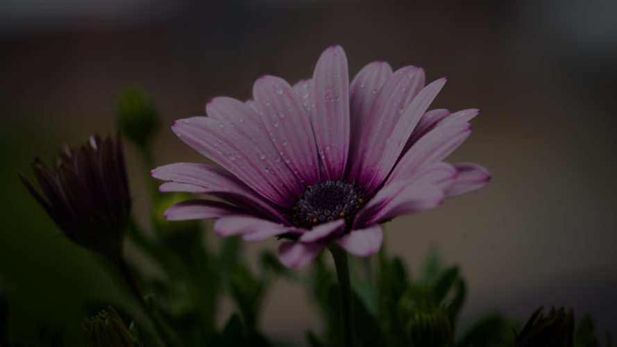

# PA1 - Image and Signal Processing

## Overview

The CLI is very similar to the reference binary with several minor differences
outlined in the CLI usage of each section. You can also click on thumbnails to
view the full resolution image.

**Usage:** `./image -<filter> args... < in.bmp > out.bmp`

BMP's are read from `stdin` and piped to `stdout`. **stb\_image** and
**stb\_image\_write** do not support read/writing to an arbitary `iostream` so
the `stdin` input is first written to a temporary binary file on disk, loaded,
the filter applied, written back to disk, and then piped to `stdout` in binary.

Pixel channels are represented as floating point in the [0, 1] range for
convenience and converted from/to 24-bit RGBA during the read/write phase.

## Libraries

- [stb\_image](https://github.com/nothings/stb)
- [stb\_image\_write](https://github.com/nothings/stb)
- [GLM](https://github.com/g-truc/glm)

**stb\_image** and **stb\_image\_write** were used only for loading and saving
images while **GLM** was used for the refraction calculation in my custom
filter.

## Binaries

Binaries for macOS and Linux can be found in the [bin directory](bin).

## 3.2 Basic Operations

### Brightness

**CLI:** `./image -brightness factor`

| Original | 0.0 | 0.5 | 1.0 | 1.5 | 2.0 |
|:---:|:---:|:---:|:---:|:---:|:---:|
|||||||

### Contrast

**CLI:** `./image -contrast factor`

| Original | -0.5 | 0.0 | 0.5 | 1.0 | 1.7 |
|:---:|:---:|:---:|:---:|:---:|:---:|
|||||||

### Saturation

**CLI:** `./image -saturation factor`

| Original | -1.0 | 0.0 | 0.5 | 1.0 | 2.5 |
|:---:|:---:|:---:|:---:|:---:|:---:|
|||||||

### Gamma

**CLI:** `./image -gamma factor`

| Original | 0.0 | 0.5 | 1.0 | 1.5 | 2.0 |
|:---:|:---:|:---:|:---:|:---:|:---:|
|||||||

### Crop

**CLI:** `./image -crop x y width height`

| Original | (100, 100, 200, 200) |
|:---:|:---:|
|||

## 3.3 Quantization and Dithering

### Quantize

**CLI:** `./image -quantize bits`

| Original | 1 | 2 | 4 | 6 | 8 |
|:---:|:---:|:---:|:---:|:---:|:---:|
|||||||

The standard quantization method described in the assignment was used for this
filter. Since RGBA channels are floating point in the [0, 1] range extra care
had to be taken during rounding.

### Random Dither

**CLI:** `./image -random-dither bits` (Slightly different from reference
binary)

| Original | 1 | 2 | 4 | 6 | 8 |
|:---:|:---:|:---:|:---:|:---:|:---:|
|||||||

Since we store RGBA channels are in the [0, 1] floating point range, we first
convert the RGBA channel to the [0, 255] range (8-bit) and then apply random
noise in the [-0.5, 0.5] range as suggested. Of course we convert back to the
[0, 1] range after quantizing.

### Floyd Steinberg Dither

**CLI:** `./image -floyd-steinberg-dither bits` (Slightly different from
reference binary)

| Original | 1 | 2 | 4 | 6 | 8 |
|:---:|:---:|:---:|:---:|:---:|:---:|
|||||||

The error propagation constants (alpha, beta, gamma, delta) are normalized to
ensure that the multiplicative weight factor of the error propagating from each
pixel adds up to 1.0 at the edges and corners. This ensures edge brightness is
similar to that of the source image.

## 3.4 Basic Convolution and Edge Detection

### Blur

**CLI:** `./image -blur n`

| Original | 3 | 5 | 7 | 11 | 13 | 17 |
|:---:|:---:|:---:|:---:|:---:|:---:|:---:|
||||||||

**Note:** The Gaussian blur filter was normalized to add up to 1.0 for
in-bounds pixels to ensure consistent brightness at the edges.

### Sharpen

**CLI:** `./image -sharpen`

| Original | 3 x 3 |
|:---:|:---:|
|||

The sharpen filter was normalized to add up to 1.0 for in-bounds pixels to
ensure consistent brightness at the edges. You may not see a difference in
the thumbnail for these images so viewing the full-res images for comparison
is recommended.

### Edge Detect

**CLI:** `./image -edge-detect threshold`

| Original | 10 | 50 | 100 | 200 |
|:---:|:---:|:---:|:---:|:---:|
||||||
||||||
||||||

**Note:** Standard Sobel edge detector filters were convolved over the image
but **not** normalized because the weighted sum of each filter is 0.

## 3.5 Antialiased Scale and Shift

### Scale

**CLI:** `./image -size width height sampling`

| Sampling | Original | 128 x 128 | 200 x 400 | 900 x 600 | 768 x 768 |
|:---:|:---:|:---:|:---:|:---:|:---:|
| Nearest Neighbor (sampling = 1) ||||||
| Hat (sampling = 2) ||||||
| Mitchell (sampling = 3) ||||||

Scale was applied in two separate steps - first to the x-axis and then the
y-axis. By transposing the image between after both operations we were able
to re-use our code for a single dimension and apply it to both. As we can see,
nearest neighbor performs very poorly when downscaling as the different
squares in the grid appear to be of different size. The hat and Mitchell filter
are much better at preserving overall appearance at the cost of bluriness.

### Shift

**CLI:** `./image -shift sx sy sampling`

| Sampling | Original | (-40, -40) | (-20.3, -20.7) | (40, 40) | (20.3, 20.7) |
|:---:|:---:|:---:|:---:|:---:|:---:|
| Nearest Neighbor (sampling = 1) ||||||
| Hat (sampling = 2) ||||||
| Mitchell (sampling = 3) ||||||

Like scale, shift was applied in two separate steps - first to the x-axis and
then the y-axis. By transposing the image between after both operations we
were able to re-use our code for a single dimension and apply it to both. As
with scaling, we can see that nearest neighbor performs poorly and leads to
inconsistent sizing of squares in the grid.

## 3.6 Fun

**CLI:** `./image -ripple depth frequency`

| Original | (25, 8) | (50, 16) | (75, 32) | (100, 64) |
|:---:|:---:|:---:|:---:|:---:|
||||||

I implemented a water ripple effect for my custom filter. The filter uses a
camera centered directly above the image using orthographic projection of rays.
Essentially camera rays are orthonormal to the image plane.

The idea behind the filter is to simulate a cosine wave propagating from the
center of the image. To do this we create a `width` x `height` matrix of
wave normal vectors at each pixel in the image. To do this we calculate the
tangent `T` of the wave at each point taking the derivative of the wave height
`dcos(x)/dx = -sin(x)`. Similar to how we create a coordinate frame from three
`(u, v, w)` vectors, we find the normal `N = cross(T, cross(T, R))` where `R`
is the ray vector which is orthonormal to the image plane.

After projecting the ray into a particular pixel in the image, we refract the
ray using [glm::refract](https://www.khronos.org/registry/OpenGL-Refpages/gl4/html/refract.xhtml).
The index of refraction for water is `~1.33` so the ratio of refraction between
air and water is `1/1.33 = 0.75`.

Call the refracted ray `R' = glm::refract(R, N, 0.75)`. Besides the normal `N`
of the wave at a pixel we have the height `H` of the wave. Using this we can
calculate the `x` and `y` offset the refracted wave experiences before reaching
the underlying image. Thus, the output pixel `(x, y)` maps to source pixel
`(x', y') = (x + R'.x * H/R'.z, y + R'.y * H/R'.z)`. `x'` and `y'` may be
floating point so for simplicity we sample the nearest descrete pixel.

The `filters::ripple(...)` function has an adjustable frequency parameter that
changes the density of the ripples in the image with higher frequencies
resulting in more closely packed ripples. There is also a depth parameter that
adjusts the base height of the wave with larger depths resulting in more
distortion as refracted rays have further to travel.
