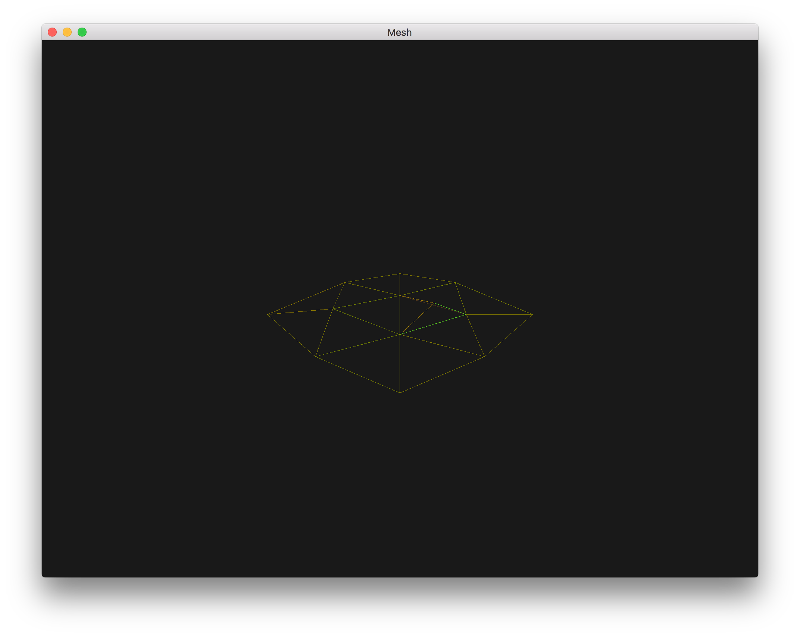

# PA2 - Geometric Modeling and Mesh Simplification

## Libraries

- [GLFW](http://www.glfw.org/)
- [glad](https://github.com/Dav1dde/glad)
- [GLM](https://github.com/g-truc/glm)
- [args](https://github.com/Taywee/args)
- [spdlog](https://github.com/gabime/spdlog)

## Usage

```
./mesh {OPTIONS} [geometry]

  mesh

OPTIONS:

    geometry                          OFF geometry file
    --shaders=[shaders]               path to the shaders
    --thresh=[thresh]                 distance between contraction pairs
                                      relative to mesh
    --faces=[faces]                   mesh simplification factor
    --wire                            render wireframe
    --help                            display this help menu
    "--" can be used to terminate flag options and force all following
    arguments to be treated as positional options
```

## Binaries

The macOS binary can be found in the [bin directory](bin). The binary **does not
come bundled with shaders** so you will need to download the [shaders](shaders)
directory and specify the path to it in the CLI interface when executing the
binary.

## Interface

- **Arrow Keys**: Rotate camera around the mesh
- **Scroll Wheel**: Zoom in/out
- **Click and Drag**: Click and drag up to increase the level of detail, click and drag down to decrease the level of detail

## Demo

[](https://www.youtube.com/watch?v=By_aKqMHP7Y)

## Data Structure

The core of the simplification algorithm involves vertex contractions so the main goal of the data structure is to support this operation in O(1) time. A contraction involves taking two vertices `(a, b)`, replacing them with a vertex c, and updating the vertex references in the face set. For this reason we wish to optimize for fast (1) vertex position updates and (2) face vertex reference updates.

The simplest way of accomplishing this is to use an indexed Vertex-Face-Set. This is just like an indexed Face-Set where each face is a set of vertex references, but we also keep a vertex-to-triangle index that tracks a set of triangle references that each vertex is a part of.

In code we have these as members of the mesh class.

- **V**: Vector of vertices where each is identified by its index in the vector
- **T**: Vector of triangles each containing tree vertex indices and identified by its index in the vector
- **VT**- Vector of ordered sets where each `VT[i]` in the set of triangle indices in T that vertex i is part of

Note that we are using an ordered set, usually a balanced tree, to track the set of triangles each vertex is part of. This is useful because we can easily and very efficiently use [std::set_intersection](http://en.cppreference.com/w/cpp/algorithm/set_intersection) to get the the set of triangles connected to two vertices which is needed in the edge contraction stage.

We could have used hash sets for each `VT[i]` but ordered sets/trees were 25% to 40% faster in benchmarks on large meshes.

## Edge Contraction

We define an edge contraction as `(a, b)` where a and b are vertices in `V`. Vertices a and b are collapsed into a single vertex c, the optimal location of which is derived in [Garland's 97 paper](http://cseweb.ucsd.edu/~ravir/190/2016/garland97.pdf) on mesh simplification.

To perform this operate in O(1) time we begin by iterating over the intersection of `VT[index(a)]` and `VT[index(b)]` and marking all such triangles as "garbage" since all of these triangles degenerate to two unique vertices or a line. We do not update the vertex references/indexes for these triangles for convenience in vertex splits.

We then overwrite `V[index(a)] = c` which automatically updates a to c for all triangles referencing a. To deal with vertex b, we iterate through all triangles that contain b using `VT[index(b)]` and update any occurrences of b to a. This step may not seem like O(1) but even for large meshes with 500k+ faces we have not seen vertices that are part of more than 18 faces concurrently. In general `|VT[i]|` is very small so we treat the set size as a constant. Of course this does not hold in absolute terms, but in practice it does.

When updating vertex references or marking triangles as "non-garbage" we must be carefully to keep `VT` properly in sync. For example, when changing vertex reference x to y in triangle i we must erase i from `VT[x]` and insert i into `VT[y]`.

The following images show the midpoint contraction of vertices 0 and 1 in [testpatch.off](http://cseweb.ucsd.edu/~viscomp/classes/cse163/sp17/models/testpatch.off).

| Original  | Contraction |
|:---------:|:----------:|
|||
|||

Likewise, the following images show the contraction of vertices 11 and 23 in [plane.off](http://cseweb.ucsd.edu/~viscomp/classes/cse163/sp17/models/plane.off) to the original position of vertex 11.

| Original  | Contraction |
|:---------:|:----------:|
|||

## Quadric Simplification

The simplification algorithm is based entriely on [Garland's 97 paper](http://cseweb.ucsd.edu/~ravir/190/2016/garland97.pdf). Let's expand out definition of an edge contraction between two vertices a and b as a tuple `(a, b, error(a, b))`.

As in the paper, we begin by calculating a matrix `Q` of quadric error metrics for all pairs of vertices. Initially we seed the heap (actually a tree) of edge contractions with all vertex pairs `(a, b)` such that `distance(a, b) < threshold`. This is actually a fairly time consuming procedure for large meshes containing several hundred thousand vertices. For a mesh with just 250k vertices there are over 31 billion unique pairs to consider. To optimize this we could use a KD-Tree for pruning the search space of nearby vertices. A simpler solution we employed is to optimize the mesh before simplification by sorting `V` (and reindexing `T` and `VT`) along a single dimension. This way, when searching for vertices within distance d of vertex i, we just iterate for j from i + 1 to `|V|` until `distance(i, j) > d`. This simple procedure does an excellent job pruning most of the search space for small thresholds.

Our implementation uses an ordered set/tree that stores contractions in increasing order of error instead of a heap. This is useful because when we contract vertex pair `(a, b)` to form vertex c, we must update the contractions for all vertex pairs `(a, x, error(a, x))` to `(c, x, error(c, x))` and `(b, x, error(b, x))` to `(c, x, error(c, x))`. Such `(a, x)` and `(b, x)` pairs may already be in the heap so we need an efficient way of updating them. It is **not** ok to keep an index `index(a) => {pointer((a, x, e(a, x)) in heap)...}` and update the contraction pair through a pointer because this will not update it's rank in the heap. We need to do a complete removal, update, and re-insertion into the heap for the update to fully propagate.

Unfortunately most standard library implementations either [do not support heap removals](http://en.cppreference.com/w/cpp/container/priority_queue) or [take O(n) time](http://stackoverflow.com/questions/12719066/priority-queue-remove-complexity-time). It's possible to build a heap with an internal `contraction => node(contraction)` index for O(log n) removals but we simply use a tree as a heap with n `vertex => {contractions...}` index.

- **PS**: Pair set (tree) that acts as a contraction pair heap ordered in increasing order of errors
- **PI**: Pair index that is a vector of sets where each `PI[i]` is the set of contraction pairs `(i, x)` that are in PS

The most crucial step follows. After performing a contraction `(a, b, error(a, b))` we create copies `PI[a]'` and `PI[b]'` of `PI[a]` and `PI[b]`. We then go through all p in `PI[a]'` or `PI[b]'`, erase them from PS, `PI[a]`, and `PI[b]`, and lastly create updated contraction pairs `(c, x, error(c, x))` and `(c, y, error(c, y))` from pairs `(a, x)` and `(b, y)` that we insert into PS, `PI[a]`, and `PI[b]`.

The following table shows the [cow model](http://cseweb.ucsd.edu/~viscomp/classes/cse163/sp17/models/) at various levels of simplification.

| 5000 Faces| 2500 Faces | 1500 Faces | 750 Faces | 300 Faces | 100 Faces |
|:---------:|:----------:|:----------:|:---------:|:---------:|:---------:|
|||||||

## Progressive Meshes

During the simplification stage we track the sequence of applied contractions in a vector. We can then scroll forwards through this sequence using contractions to simplify the mesh and backwards using vertex splits to increase the level of detail.

To support vertex splits we need to be able to reassemble edge `(x, c)` to `(x, a)` or `(x, b)` after splitting vertex c into a and b. How do we know what the edge should be?

In [Hoppe's 96 paper](http://hhoppe.com/pm.pdf) on progressive meshes he describes a method of storing an addition pair of vertices that are at intuitively on the "left" and "right" of the collapsed edge to resolve this ambiguity. Unfortunately this does not work on meshes that are not 2D-manifolds which is a problem because Garland's algorithm supports arbitrary vertex pair collapses, not just edge collapses, that may result in a non-manifold mesh.

The solution we came up with is to extend our edge collapse definition to `(a, b, error(a, b), A, AT, BT)`.

- **A**: The original position of vertex a before it was overwritten by the optimal collapse of a and b so that we can set `V[index(a)] = A` during a split. Note that we do not update `V[index(b)]` since we left it untouched during the contraction.
- **AT**: The set of triangles before the collapse of `(a, b)` that contained the original vertex a.
- **BT**: Same as AT but for vertex b.

During a split operation these sets resolve an ambiguity on how to reverse the operations on triangles `T[index(c)]` when splitting c back into a and b. Such triangles fall into three cases which we must handle carefully.

1. **Triangles that contained both vertex a and b** - These triangles can simply be unmarked as "garbage" since the a and b references were not updated during the contraction operation that degenerated these triangles into lines.
2. **Triangles that contained just vertex a** - Do nothing!
3. **Triangles that contained just vertex b** - The original reference to b is now a reference to a (after contraction) so change the the vertex a reference back to b.

Once again, when updating vertex references or marking triangles as "non-garbage" we must be carefully to keep `VT` properly in sync.

## Performance

The following is a table showing the amount time spent in seconds simplifying each model to 100 faces on an Intel Core i7 4870HQ. The threshold was set to 0 so that only edge contractions were considered.

| Model | Faces   | Vertices | Init   | Simplify |
|:------|--------:|---------:|-------:|---------:|
| Cow   |   5,804 |    2,903 | 0.027s |  0.085s  |
| Bunny |  69,451 |   34,834 | 0.380s |  1.819s  |
| Brain | 588,032 |  294,012 | 3.544s | 17.903s  |

The OFF models are available [here](http://cseweb.ucsd.edu/~viscomp/classes/cse163/sp17/models/).
