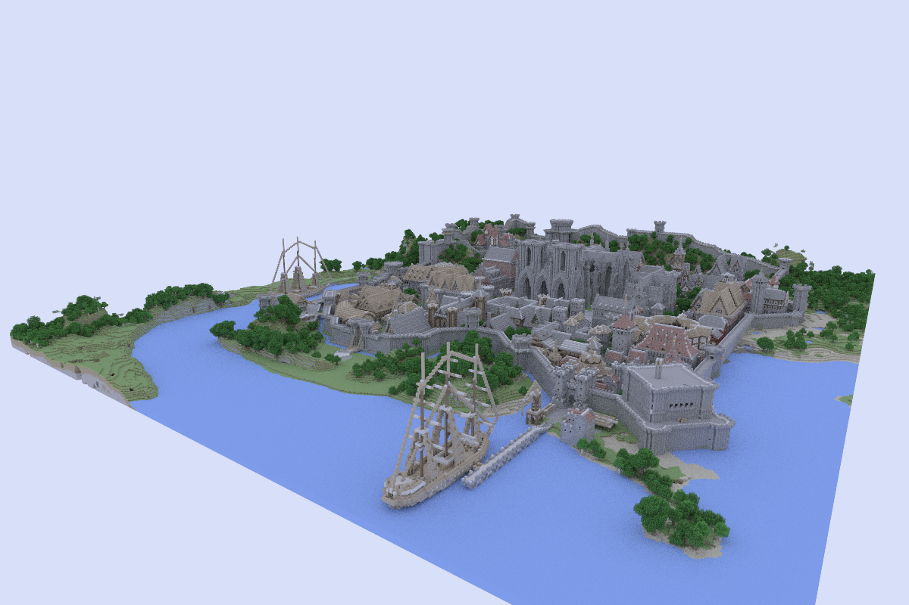

# PA3 - Path Tracing

## Libraries

- [GLM](https://github.com/g-truc/glm)
- [tinyobjloader](https://github.com/syoyo/tinyobjloader)
- [std\_image\_write](https://github.com/nothings/stb/blob/master/stb_image_write.h)
- [json](https://github.com/nlohmann/json)
- [spdlog](https://github.com/gabime/spdlog)
- [args](https://github.com/Taywee/args)

## Usage

```
./pathtracer {OPTIONS} [scene] [materials] [config] [output]

  pathtracer

OPTIONS:

    -h, --help                        display this help menu
    scene                             the scene file
    materials                         the materials directory
    config                            the config file
    output                            the output file
    "--" can be used to terminate flag options and force all following
    arguments to be treated as positional options
```

The config file is expected to be in JSON format with the same fields as `config.hpp` in the source code. Examples are available in the [config](config) directory. By default the pathtracer will write to a `render.png` file in your current working directory.

## Binaries

Binaries for macOS and Linux can be found in the [bin](bin) directory. The source code is available [here](https://github.com/andreimaximov/pathtracer).

## Introduction

I enjoyed learning about and implementing ray tracing in CSE 167 so for my final CSE 163 project I decided to write a path tracer with support for Monte Carlo global illumination, fresnel refractions, glossy surfaces, and caustics.

To not worry about creating scenes, I used the [tinyobjloader](https://github.com/syoyo/tinyobjloader) library to load OBJ scenes and MTL materials available [here](http://graphics.cs.williams.edu/data/meshes.xml).

The `render.png` output file is updated once a second so you can observe the render clean up with more samples.

## Features

The following are several key features of my path tracer.

- **Monte Carlo Importance Sampling** - The [cosine weighted hemisphere](http://www.rorydriscoll.com/2009/01/07/better-sampling/) is used for sampling diffuse BRDF's and a "concentrated" version with clustering towards the top is used for importance sampling rough/glossy reflection BRDF's. This increases the rate of convergence while maintaining realistic effects like soft shadows and indirect illumination.

- **Fresnel Reflection/Refraction** - Realistic glass and water materials with fresnel based reflection/refraction light splitting is supported. In each iteration we make a probabilistic choice to sample the reflection BRDF or refraction BTDF of a material based on the fresnel factor.

- **Russian Roulette Path Termination** - To avoid the bias of having a finite recursion depth I used Russian Roulette to randomize my path termination and scale non-terminated paths by the inverse probability of the ray not being terminated. The probability is adaptively scaled based on the intensity of the material the ray has intersected with. Since rays bouncing off dark materials will contribute less to the overall cover of the scene we can perform shallower sampling - the opposite holds for materials with high intensities.

- **Direct Light Sampling** - To greatly speedup convergence emissive objects are stored in a list of lights. When estimating the color of a diffuse surface we (1) uniformly sample a random light and divide by `PDF = 1 / (# of lights)` and (2) importance sample the BRDF. One thing to be careful of is to not double count lights by ignoring them in the indirect lighting sample. This results in much faster convergence for scenes with lots of diffuse surfaces.

- **Texture Mapping** - Diffuse textures will be loaded from the materials directory if specified in the associated MTL file. Texturing can be disabled via the `use_textures` option in the scene config. Note that having many transparent textures can decrease performance as the ray depth is not incremented when it passes through a transparent pixel in a texture which can lead to needing more logical bounces for each physical bounce.

- **Bounding Volume Hierarchy** - Some scenes such as Rungholt from the [Williams graphics dataset ](http://graphics.cs.williams.edu/data/meshes.xml) have an extremely high vertex count (several million). I used a BVH to optimize ray intersection tests to ~O(log N). This was largely borrowed from my CSE 167 assignment but I made several optimizations to it such as handling the case of bad splits that can result from large overlap along the midpoint of the dimension with highest variance which is used as the main splitting heuristic.

- **Multi-Threaded** - Path tracing is [embarrassingly parallel](https://en.wikipedia.org/wiki/Embarrassingly_parallel) so of course multi-threading is supported. Different parts of the image however may have different loads due to varying geometry density. For example querying the BVH for the nearest intersection of a sky pixel in the Rungholt scene is many times faster than a pixel in the middle of the castle. To address this dynamic scheduling via a work queue is used to assign threads partitions to work on.

## Renders

The following are several [Cornell Box](https://en.wikipedia.org/wiki/Cornell_box) renders using modified materials from the [Williams graphics dataset](http://graphics.cs.williams.edu/data/meshes.xml) to demonstrate several different material types. The configuration, geometry, and material files are available in the [config](config) and [scenes](scenes) directories. Several convenience scripts demonstrating the CLI usage are available in the [scripts](scripts) directory. The Dragon, Lost Empire, and Rungholt scenes are large files that are automatically downloaded to the `.cache` directory by the run script. If you encounter errors with the scripts you may need to clear the `.cache` directory after fixing your issue but before running the script again.


| Original - 1500 Samples | Glossy - 300 Samples | Glass - 1000 Samples | Dragon - 32 Samples |
|:-----------------------:|:--------------------:|:--------------------:|:-------------------:|
|||||

The following Cornell Boxes demonstrate the caustic effect with glass and water materials.

| Spheres - 3000 Samples | Water - 1000 Samples |
|:----------------------:|:--------------------:|
|||

Lastly are several more renderings of scenes showing simple environment lighting and texture mapping. These use unmodified original geometry and materials that can be downloaded from the [Williams graphics dataset ](http://graphics.cs.williams.edu/data/meshes.xml). Config files with camera positions and environment lighting presets are available in the [config](config) directory.

| Lost Empire - 32 Samples (With Textures) | Lost Empire - 250 Samples (No Textures) |
|:----------------------------------------:|:---------------------------------------:|
| |  |

| Rungholt - 50 Samples (With Textures) | Rungholt - 32 Samples (No Textures) |
|:-------------------------------------:|:-----------------------------------:|
| | |

**Note:** These images were rendered until they were "good enough" - sometimes much longer than necessary as I left the pathtracer running on a Digital Ocean instance.

## Resources

The following is a list of resources I used to learn about path tracing and Monte Carlo sampling.

- [https://www.scratchapixel.com/lessons/3d-basic-rendering/global-illumination-path-tracing/global-illumination-path-tracing-practical-implementation](ttps://www.scratchapixel.com/lessons/3d-basic-rendering/global-illumination-path-tracing/global-illumination-path-tracing-practical-implementation)
- [https://www.scratchapixel.com/lessons/3d-basic-rendering/introduction-to-shading/reflection-refraction-fresnel](https://www.scratchapixel.com/lessons/3d-basic-rendering/introduction-to-shading/reflection-refraction-fresnel)
- [https://cseweb.ucsd.edu/classes/sp17/cse168-a/CSE168\_07\_Random.pdf](https://cseweb.ucsd.edu/classes/sp17/cse168-a/CSE168_07_Random.pdf)
- [https://cseweb.ucsd.edu/classes/sp17/cse168-a/CSE168\_08\_PathTracing.pdf](https://cseweb.ucsd.edu/classes/sp17/cse168-a/CSE168_08_PathTracing.pdf)
- [https://cseweb.ucsd.edu/classes/sp17/cse168-a/CSE168\_13\_PathTracing2.pdf](https://cseweb.ucsd.edu/classes/sp17/cse168-a/CSE168_13_PathTracing2.pdf)
- [https://inst.eecs.berkeley.edu/~cs283/sp13/lectures/283-lecture10.pdf](https://inst.eecs.berkeley.edu/~cs283/sp13/lectures/283-lecture10.pdf)
- [http://www.joesfer.com/?p=84](http://www.joesfer.com/?p=84)
- [https://en.wikipedia.org/wiki/Fresnel\_equations](https://en.wikipedia.org/wiki/Fresnel_equations)
